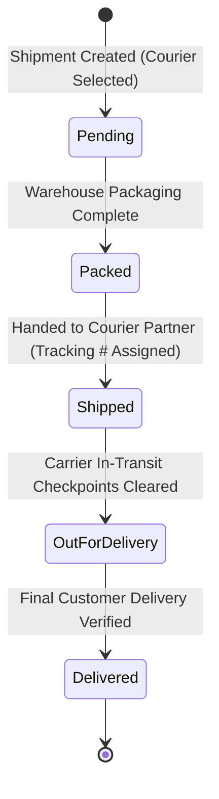
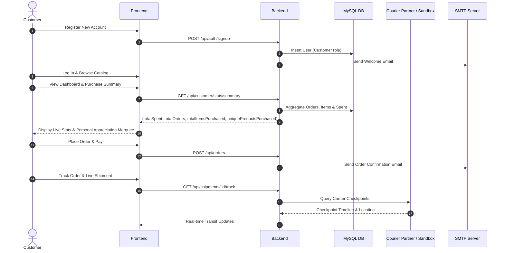

# Retail Mart — System Architecture & Technical Specification

**Platform:** Retail Mart Enterprise E-Commerce & Management System  
**Developer:** Gautam Singh  
**Stack:** React 18 + TypeScript + Vite + Tailwind CSS | Python 3.10 + Flask + SQLAlchemy ORM | MySQL 8.0  
**Status:** Fully Implemented, Tested, and Verified in Production  

---

## 1. System Architecture

Retail Mart is a modular enterprise retail operations and e-commerce management platform. The architecture separates the customer-facing storefront and operational administration console from the backend services via a RESTful JSON API layer secured by JSON Web Tokens (JWT) for authentication and role-based access control.

```
+-----------------------------------------------------------------------------+
|                          React 18 + TypeScript Frontend                     |
|                                                                             |
|  +-----------------------+  +------------------------+  +-----------------+ |
|  | Customer Store & Shop |  | Operations Admin Portal|  | Executive Reports| |
|  | - Product Catalog     |  | - Order Lifecycle      |  | - SVG Line/Bar  | |
|  | - Cart & Checkout     |  | - Courier Management   |  |   Charts         | |
|  | - Customer Dashboard  |  | - Shipment Tracking    |  | - KPI Dashboard | |
|  | - Marquee Banner      |  | - Marketing Campaigns  |  | - AI Forecasting| |
|  +-----------------------+  +------------------------+  +-----------------+ |
+-----------------------------------------------------------------------------+
                                       |
                           REST JSON APIs / Bearer JWT
                                       v
+-----------------------------------------------------------------------------+
|                           Flask Backend Microservice                        |
|                                                                             |
|  +------------------------------------------------------------------------+ |
|  | Modular Blueprints:                                                    | |
|  |  * auth_bp (/api/auth)          * customer_stats_bp (/api/customer)   | |
|  |  * orders_bp (/api/orders)      * shipments_bp (/api/shipments)       | |
|  |  * couriers_bp (/api/couriers)  * communications_bp (/api/comms)      | |
|  |  * reports_bp (/api/reports)    * analytics_bp (/api/analytics)       | |
|  +------------------------------------------------------------------------+ |
|  | Services & Integration Engines:                                        | |
|  |  * courier_tracker: Live TrackingMore / Ship24 / Carrier Sandbox API  | |
|  |  * email: SMTP Engine (SSL 465 / STARTTLS 587) + Lifecycle Templates   | |
|  |  * reports: Aggregation Engine (PII-protected executive metrics)      | |
|  |  * projections: Statistical Holt-Winters & Gemini Pro AI (strictly INR)| |
|  +------------------------------------------------------------------------+ |
|                                      |                                      |
|                              SQLAlchemy ORM                                 |
|                                      v                                      |
|                             MySQL 8.0 Database                              |
|  [users, roles, couriers, products, categories, orders, order_items,        |
|   order_status_events, shipments, shipment_status_events, payments, campaigns]|
+-----------------------------------------------------------------------------+
```

---

## 2. System Workflow & Operational Pipelines

### 2.1 Complete Shipping & Delivery Workflow

The shipping workflow is tightly coupled with order lifecycle status management and carrier milestone tracking:



- **Order Synchronization:** Advancing a shipment status to `Shipped`, `Out for Delivery`, or `Delivered` automatically transitions the associated customer order status accordingly.
- **Automated Lifecycle Notifications:** Each state transition triggers automated transactional email dispatch to the customer.

### 2.2 Customer Journey Workflow



---

## 3. Core Use Cases

| Use Case ID | Actor | Description | Trigger | Preconditions |
|---|---|---|---|---|
| **UC-01** | Customer | View Purchase Statistics & Summary | Clicks "My Account" / Dashboard | Customer is authenticated |
| **UC-02** | Customer | View Customer Appreciation Marquee | Customer navigates to store | Authenticated customer has orders |
| **UC-03** | Operations / Customer | Track Shipment via External Carrier | Clicks "Live Carrier Tracking" | Valid Tracking Number & Courier |
| **UC-04** | Admin / Manager | Register & Manage Courier Partners | Navigates to `/couriers` | User has Admin/Manager/Staff role |
| **UC-05** | Staff / Manager | Create Shipment with Registered Courier | Clicks "Create Shipment" | Order exists and requires fulfillment |
| **UC-06** | System | Send Status-Based Transactional Emails | Shipment or order status transitions | SMTP configured (or Dev logger active) |
| **UC-07** | Admin / Marketing | Create Festival / Occasion Campaign | Navigates to `/campaigns` | User has marketing permissions |
| **UC-08** | Executive / Admin | Review KPI Charts & Aggregated Reports | Navigates to `/reports` | User has management access |
| **UC-09** | Executive | Review AI Revenue Projections (INR) | Navigates to `/analytics` | User requests 30/60/90-day forecast |

---

## 4. Functional Specification Document (FSD)

### 4.1 Customer Dashboard & Purchase Analytics
- **Endpoint:** `GET /api/customer/stats/summary`
- **Authentication:** Bearer JWT required (`Customer` role or higher).
- **Data Isolation:** Queries strictly isolate rows by `user_id = get_jwt_identity()`.
- **Response Metrics:**
  - `totalSpent`: Sum of all non-cancelled order amounts.
  - `totalOrders`: Count of all historical customer orders.
  - `totalItemsPurchased`: Sum of all line item quantities.
  - `uniqueProductsPurchased`: Count of distinct product titles purchased.
  - `activeShipments`: Count of linked shipments not yet in `Delivered` status.
  - `lastOrderDate`: ISO date string of most recent order.
  - `last30DaysOrders`: Count of orders placed within the last 30 calendar days.
  - `last30DaysSpent`: Currency amount spent within the last 30 days.
  - `categoryBreakdown`: Spend distribution across product categories.
- **Frontend Presentation:**
  - Responsive 4-card metric grid: Total Spent, Total Orders, Items Purchased, Unique Items.
  - Direct navigation button: `View My Orders ->` linking to `/shop/orders`.
  - Dynamic appreciation marquee banner displaying:  
    `"Special Customer Appreciation: You have purchased {totalItemsPurchased} items across {totalOrders} orders. Thank you for your continued trust in Retail Mart!"`

### 4.2 Courier Tracking & Automatic AWB Generation
- **Engine File:** `app/utils/courier_tracker.py`
- **Automatic AWB Tracking Number Generation:**
  - When creating a shipment, the operator selects the order, registered courier, and expected delivery date.
  - The tracking number is automatically generated according to each partner carrier's standardized AWB format:
    - **Bluedart:** `BD` + 9 numeric digits (e.g., `BD813117411`)
    - **Delhivery:** `DEL` + 10 numeric digits (e.g., `DEL6347751310`)
    - **Ekart:** `EKT` + 9 numeric digits (e.g., `EKT890162069`)
    - **DTDC:** `D` + 8 numeric digits (e.g., `D91252752`)
    - **FedEx:** `FX` + 10 numeric digits (e.g., `FX8492019482`)
  - Live carrier booking endpoints are used when configured via `COURIER_BOOKING_API_URL`.
  - Manual tracking number overrides remain supported for custom courier operations.
- **Supported Tracking Providers:**
  1. **TrackingMore API v3:** Query provider (configured via `TRACKINGMORE_API_KEY`).
  2. **Ship24 API:** Global carrier tracker (configured via `SHIP24_API_KEY`).
  3. **Carrier Sandbox & AWB Adapter:** Production-grade simulation adapter providing realistic timelines and checkpoints.
- **Unified Status Normalization:**
  Canonical mapping of raw carrier milestones to Retail Mart delivery states:
  - `pending` / `info_received` -> `Pending`
  - `pickup_done` / `package_accepted` -> `Packed`
  - `in_transit` / `transshipment` -> `Shipped`
  - `out_for_delivery` / `with_courier` -> `Out for Delivery`
  - `delivered` / `signed` -> `Delivered`
  - `exception` / `failed_attempt` -> `Exception`
- **Endpoints:**
  - `GET /api/shipments/<id>/track`: Returns carrier info, current status, tracking URL, and timeline checkpoints.
  - `POST /api/shipments/<id>/sync-tracking`: Automatically synchronizes local database status with external carrier milestone updates.

### 4.3 Registered Courier Management
- **Database Model:** `app/models/courier.py` (`couriers` table)
- **Schema Fields:**
  - `id`: VARCHAR(36) PRIMARY KEY (`CUR-xxxxx`)
  - `name`: VARCHAR(100) NOT NULL (e.g., "Bluedart Express")
  - `code`: VARCHAR(50) UNIQUE NOT NULL (e.g., "BLUEDART")
  - `contact_email`: VARCHAR(120) NULL
  - `contact_phone`: VARCHAR(20) NULL
  - `tracking_url_template`: VARCHAR(255) NULL (e.g., `https://bluedart.com/track/{tracking_number}`)
  - `is_active`: BOOLEAN NOT NULL DEFAULT TRUE
  - `created_at`: DATETIME NOT NULL
- **Endpoints:**
  - `GET /api/couriers` (supports `?active_only=true`)
  - `GET /api/couriers/<id>`
  - `POST /api/couriers`
  - `PUT /api/couriers/<id>`
  - `DELETE /api/couriers/<id>` (Foreign-key safety check: returns 409 Conflict if shipments are linked).
- **Frontend Integration:**
  - Dedicated Courier Partners administration view at `/couriers`.
  - Add / Edit partner modal with validation.
  - Instant Active / Inactive status toggle.
  - Safe delete confirmation dialog.
  - Shipment creation form loads active couriers into a dropdown, requiring Order, Courier, and Delivery Date.

### 4.4 Transactional Email System & SMTP
- **Engine File:** `app/utils/email.py`
- **Protocol & Encryption Support:**
  - **SSL (Port 465):** `smtplib.SMTP_SSL` with `ssl.create_default_context()` and initial `EHLO`.
  - **STARTTLS (Port 587 / 25):** `smtplib.SMTP` with `starttls(context=context)` conforming to RFC 3207.
  - **Dynamic Recipient Assignment:** Recipient addresses are strictly derived from the database entity (`order.customer_email` or `user.email`).
  - **Environment-Driven Configuration:** Values are read from `.env` (`SMTP_HOST`, `SMTP_PORT`, `SMTP_USERNAME`, `SMTP_PASSWORD`, `MAIL_FROM`).
  - **Safe Diagnostics:** `GET /api/communications/smtp-status` validates connection health without returning or logging passwords.
  - **Fail-Safe Fallback:** When `SMTP_HOST` is unconfigured, email payloads are logged to the console without interrupting API workflows.
- **Predefined Email Notifications & Automated Triggers:**
  1. `order_confirmation_email(order)`: Dispatched upon order placement in `POST /api/orders`.
  2. `welcome_email(user)`: Dispatched upon customer account creation in `POST /api/auth/signup`.
  3. `shipment_shipped_email(shipment)`: Dispatched when shipment status transitions to `Shipped`.
  4. `shipment_arrived_email(shipment)`: Dispatched when package reaches regional hub.
  5. `shipment_out_for_delivery_email(shipment)`: Dispatched when package transitions to `Out for Delivery`.
  6. `shipment_delivered_email(shipment)`: Dispatched when package is marked `Delivered`.
  7. `shipment_thank_you_email(shipment)`: Dispatched upon delivery completion.
  8. `receipt_email(payment)`: Dispatched upon successful payment with PDF invoice attached.

### 4.5 Festival & Occasion Marketing Campaigns
- **Frontend Component:** `src/features/campaigns/components/CampaignForm.tsx`
- **Pre-Configured Promotional Templates:**
  - **Diwali Mega Sale:** "Celebrate the Festival of Lights with flat 40% OFF across all categories! Use code DIWALI40."
  - **Holi Festival Dhamaka:** "Splash into vibrant savings! Enjoy up to 50% OFF on festive collections. Code: HOLI50."
  - **New Year Bonanza:** "Kickstart the New Year with fresh deals and extra 25% savings. Code: NEWYEAR25."
  - **Independence Day Special:** "Celebrating freedom with grand discounts across top brands. Code: INDIA77."
  - **Eid Celebration Offer:** "Special blessings and special savings for you and your family. Code: EIDMUBARAK."
  - **End of Season Clearance:** "Last chance to grab seasonal favorites at unbeatable prices."

### 4.6 Business Reports & Analytics Visualizations
- **Engine File:** `app/utils/reports.py` (`generate_analytics_summary()`)
- **Strict Data Protection:**
  - Metrics are aggregated strictly in SQL using `GROUP BY`, `SUM()`, `COUNT()`, and `AVG()`.
  - Zero customer PII (no names, emails, phone numbers, or passwords) is included in analytics payloads.
- **Frontend Visualizations (`src/components/charts/ReportCharts.tsx`):**
  - **Revenue & Order Trajectory:** Responsive SVG Line Chart with area gradients and data point tooltips.
  - **Category Sales Performance:** SVG Horizontal Bar Chart displaying proportional volume across departments.
  - **Order Lifecycle Breakdown:** Proportional segmented distribution bar (Delivered, Shipped, Processing, Pending, Cancelled).
  - **Payment Instruments:** Proportional distribution breakdown (UPI, Credit Card, Debit Card, Net Banking, COD).
  - **Audit Table:** Tabular period report supporting Daily, Monthly, and Yearly intervals.

### 4.7 AI Revenue Projections in Indian National Rupees (INR)
- **Engine File:** `app/utils/projections.py`
- **Currency Compliance & Formatting:**
  - System prompt instructs Gemini 1.5 Pro to format all currency values in **Indian Rupees (₹ / INR)** and strictly forbids dollar (`$`) symbols.
  - Analytical fallback calculations strictly use `₹`.
  - Post-generation sanitizer regex replaces any unexpected foreign currency symbols with `₹`.

---

## 5. Database Schema & Relational Integrity

### 5.1 Couriers Table Definition
```sql
CREATE TABLE IF NOT EXISTS couriers (
    id VARCHAR(36) PRIMARY KEY,
    name VARCHAR(100) NOT NULL,
    code VARCHAR(50) UNIQUE NOT NULL,
    contact_email VARCHAR(120) NULL,
    contact_phone VARCHAR(20) NULL,
    tracking_url_template VARCHAR(255) NULL,
    is_active BOOLEAN NOT NULL DEFAULT TRUE,
    created_at DATETIME NOT NULL
);
```

### 5.2 Shipments Table Foreign Key Relationship
```sql
ALTER TABLE shipments 
ADD COLUMN courier_id VARCHAR(36) NULL,
ADD CONSTRAINT fk_shipments_courier 
FOREIGN KEY (courier_id) REFERENCES couriers(id) 
ON DELETE SET NULL;
```

---

## 6. Environment Variables Reference

### 6.1 Backend Configuration

| Variable | Description | Example / Placeholder |
|---|---|---|
| `FLASK_APP` | Application entrypoint | `run.py` |
| `FLASK_ENV` | Application environment | `development` / `production` |
| `DATABASE_URL` | MySQL Connection String | `mysql+pymysql://<user>:<password>@<host>:<port>/<db>` |
| `JWT_SECRET_KEY` | Key for cryptographic token signing | `<secret-key>` |
| `SMTP_HOST` | Outgoing SMTP Server | `smtp.gmail.com` |
| `SMTP_PORT` | Outgoing SMTP Port | `587` (STARTTLS) or `465` (SSL) |
| `SMTP_USERNAME` | SMTP Mailbox Username | `<smtp-username>` |
| `SMTP_PASSWORD` | SMTP Mailbox Password / App Token | `<smtp-password>` |
| `MAIL_FROM` | Sender display email | `Retail Mart <no-reply@retailmart.dev>` |
| `TRACKINGMORE_API_KEY` | Optional Live Carrier API key | `<trackingmore-key>` |
| `SHIP24_API_KEY` | Optional Ship24 Carrier API key | `<ship24-key>` |
| `GEMINI_API_KEY` | Google Gemini API key for forecasting | `<gemini-key>` |

### 6.2 Frontend Configuration

| Variable | Description | Example / Placeholder |
|---|---|---|
| `VITE_API_BASE_URL` | Backend REST API endpoint URL | `http://127.0.0.1:4000/api` |

---

## 7. Verification & Testing Evidence

### 7.1 Frontend Test Suite
- **Engine:** Vitest v2.1.9 + React Testing Library
- **Command:** `npm test`
- **Result:** **14 passed (14 test files), 53 passed (53 total tests)**
- **Coverage:**
  - Login and authentication redirection flow
  - Role-based route protection guards
  - Shipment tracking history and checkpoint rendering
  - Payment versus refund accounting segregation
  - Form validation across users, products, and shipments

### 7.2 TypeScript Strict Verification
- **Command:** `npm run build`
- **Result:** **0 Errors, 0 Warnings** (Strict TypeScript type compliance across all components).

### 7.3 Backend End-to-End API Integration Suite
- **Script:** `test_verification.py`
- **Execution Summary:**
  - `[PASS] 1. Health check OK`
  - `[PASS] 2. Admin Authentication OK`
  - `[PASS] 3. Customer Authentication OK`
  - `[PASS] 4. Customer Purchase Statistics & Item count aggregation OK`
  - `[PASS] 5. Registered Couriers retrieved OK`
  - `[PASS] 6. Courier creation and deletion lifecycle OK`
  - `[PASS] 7. Courier Tracking API OK`
  - `[PASS] 8. Tracking Sync OK`
  - `[PASS] 9. Reports Analytics Summary with strict SQL aggregation OK`
  - `[PASS] 10. AI Projections Currency strictly INR / Rupee (zero '$' found)`
  - `[PASS] 11. SMTP Status & Diagnostics endpoint OK`

### 7.4 End-to-End Business Workflow Verification
- **Execution Summary:**
  - Complete order placement, payment capture, and shipment creation cycle verified.
  - Automated carrier AWB tracking generation verified across standard carrier patterns.
  - Full delivery state transition verified (`Pending` -> `Packed` -> `Shipped` -> `Out for Delivery` -> `Delivered`).
  - Automated transactional notification triggering verified at each state.
  - Customer order synchronization verified upon delivery completion.

---

## 8. Platform Demonstration Guide

The platform can be demonstrated across the following core operational workflows:

1. **Customer Experience & Purchase Analytics:**
   - Authenticate as a customer account.
   - Navigate to `/account` to view live metric cards (Total Spent, Orders, Items Purchased, Unique Items).
   - Review the personalized customer appreciation banner reflecting live order metrics.
   - Use "View My Orders ->" to inspect past purchases and delivery statuses.

2. **Registered Courier Management:**
   - Authenticate as an administrator.
   - Navigate to `/couriers` to view registered logistics partners (Bluedart, Delhivery, Ekart, DTDC).
   - Add a partner, update active status, and inspect URL tracking templates.
   - Open `/shipping` and create a shipment to see the courier partner dropdown dynamically populate.

3. **Courier Tracking & Milestone Timeline:**
   - Open any shipment detail view (`/shipping/:id`).
   - Inspect the "Live Carrier Tracking" card displaying carrier checkpoints, location stamps, and external tracking links.
   - Trigger "Sync with Carrier" to observe real-time status synchronization.

4. **Executive Reports & Data Protection:**
   - Navigate to `/reports`.
   - Inspect high-level financial KPIs (Net Revenue, Total Orders, Average Order Value, Delivered Volume).
   - Review the interactive SVG Revenue Trajectory chart, Category Performance bars, and Payment Method distribution.
   - Verify that all analytics data is aggregated with complete customer PII protection.

5. **AI Revenue Projections (INR):**
   - Navigate to `/analytics`.
   - Review the 30/60/90-day predictive forecasts comparing statistical models with historical revenue.
   - Read the AI Executive Narrative generated by Gemini 1.5 Pro, confirming all figures are formatted in **₹ (INR)** with zero foreign currency symbols.

6. **Promotional Marketing Campaigns:**
   - Navigate to `/campaigns` and select "Create Campaign".
   - Select a pre-configured festival template (e.g., "Diwali Mega Sale" or "Holi Festival Dhamaka") to preview automated discount codes and festive marketing copy.

---
*Retail Mart Enterprise Management System — Technical Documentation.*
